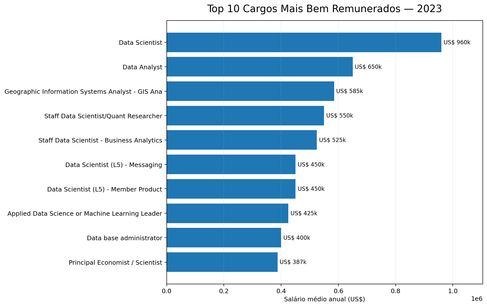
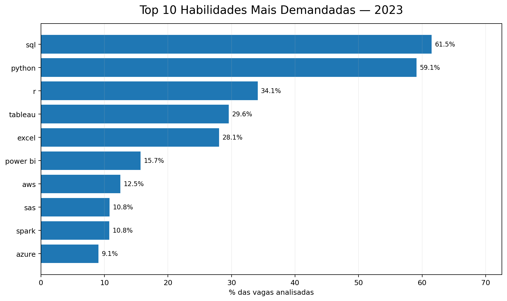
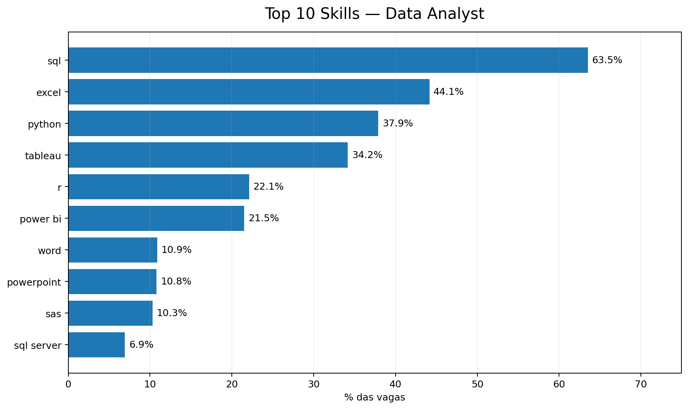
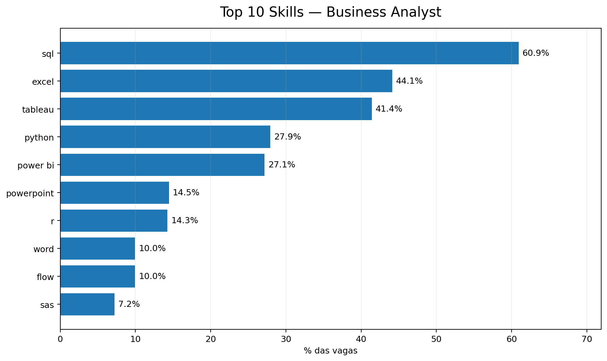
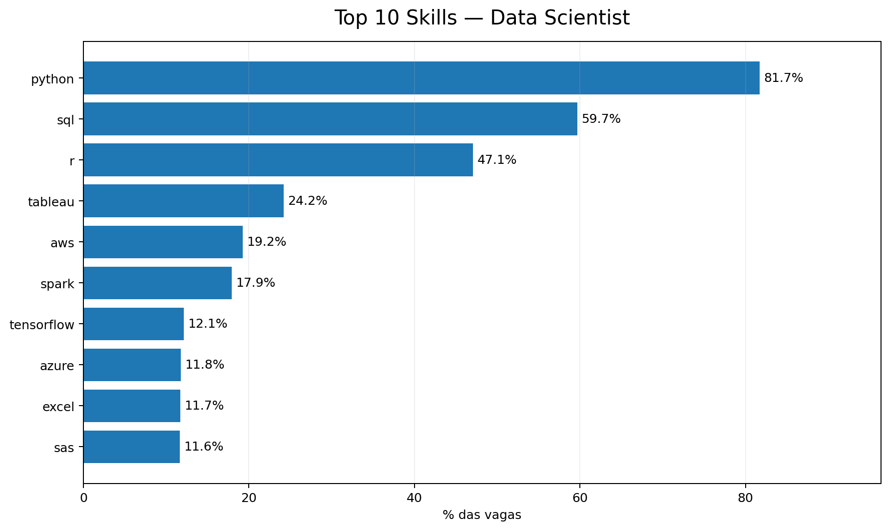
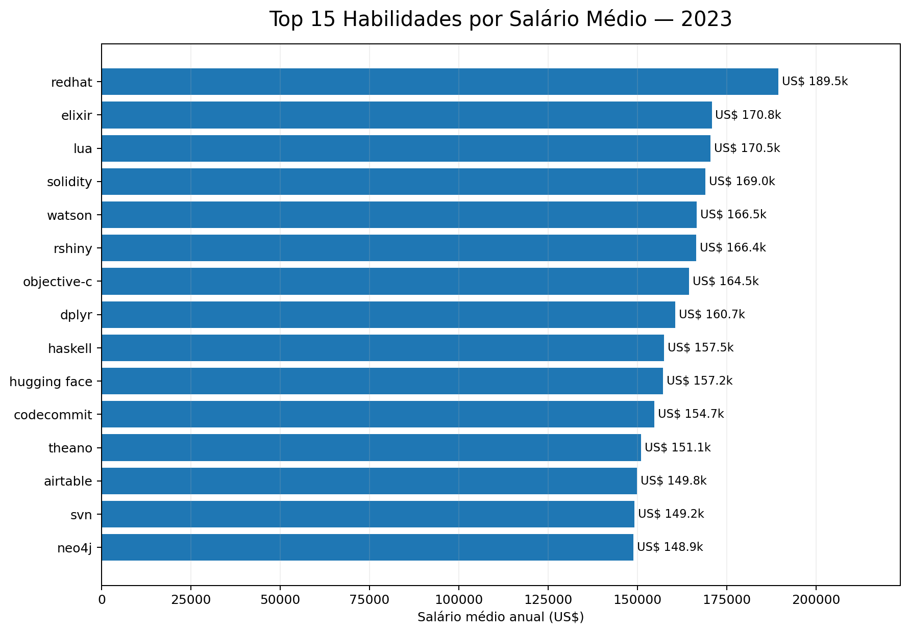
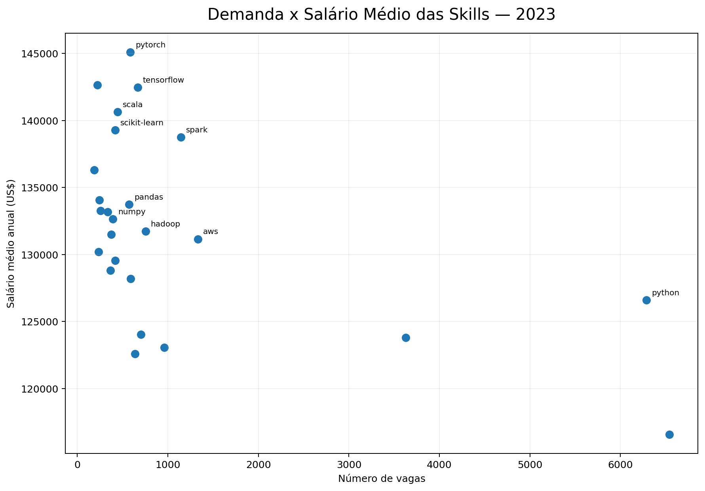

# Análise do Mercado de Trabalho em Dados

## Introduction

Este projeto explora o mercado de trabalho na área de dados, com foco em três cargos:

* **Data Analyst**
* **Business Analyst**
* **Data Scientist**

A análise utiliza SQL para investigar os cargos mais bem remunerados, as habilidades mais demandadas, as competências associadas aos maiores salários e quais skills oferecem o melhor equilíbrio entre demanda e remuneração.

As consultas SQL utilizadas no projeto estão disponíveis na pasta [`projeto_sql`](./projeto_sql/).

---

# Background

A área de dados possui uma grande variedade de cargos, ferramentas e tecnologias. Por isso, entender quais habilidades realmente aparecem nas vagas e como elas se relacionam com os salários pode ajudar profissionais e estudantes a direcionarem melhor seus estudos.

Este projeto foi desenvolvido com o objetivo de analisar dados reais de vagas publicadas em **2023**, buscando identificar padrões de remuneração e demanda para três dos principais cargos da área de dados: Data Analyst, Business Analyst e Data Scientist.

Os dados utilizados fazem parte do dataset disponibilizado no curso de SQL de [Luke Barousse](https://lukebarousse.com/sql), contendo informações sobre vagas, empresas, salários, localização e habilidades exigidas.

### As principais perguntas respondidas foram:

1. Quais foram os cargos mais bem remunerados entre Data Analyst, Business Analyst e Data Scientist em 2023?
2. Quais habilidades foram mais demandadas nesses cargos?
3. Quais habilidades estão associadas aos maiores salários médios?
4. Quais skills apresentam o melhor equilíbrio entre demanda e remuneração?

---

# Ferramentas

Para realizar a análise, utilizei as seguintes ferramentas:

* **SQL:** principal linguagem utilizada para consultar, filtrar, agrupar e analisar os dados.
* **PostgreSQL:** sistema de gerenciamento de banco de dados utilizado no projeto.
* **Visual Studio Code:** ambiente utilizado para desenvolver e organizar as consultas.
* **Git:** utilizado para controle de versão.
* **GitHub:** utilizado para armazenar e documentar o projeto.

---

# Análises

## 1. Cargos mais bem remunerados

A primeira análise buscou identificar os **10 cargos com os maiores salários anuais** entre Data Analyst, Business Analyst e Data Scientist.

A consulta considera apenas vagas que possuem informação de salário anual e ordena os resultados pelo maior salário.

```sql
SELECT
    job_id,
    job_title,
    job_title_short,
    job_country,
    CASE 
        WHEN job_location = 'Anywhere' THEN 'Remote'
        ELSE job_location
    END AS job_location,
    name AS company_name,
    job_schedule_type,
    salary_year_avg,
    job_posted_date
FROM
    job_postings_fact
LEFT JOIN company_dim ON job_postings_fact.company_id = company_dim.company_id
WHERE
    salary_year_avg IS NOT NULL AND
    job_title_short IN ('Data Analyst', 'Business Analyst', 'Data Scientist')
ORDER BY
    salary_year_avg DESC
LIMIT 10
```

### Insight

* **Data Scientist domina o ranking salarial**, representando 7 das 10 vagas mais bem remuneradas.
* O maior salário registrado chega a aproximadamente **US$ 960 mil anuais**.
* Diversas vagas de Data Scientist apresentam salários superiores a **US$ 400 mil**, evidenciando o potencial de remuneração de posições altamente especializadas e seniores.



*Top 10 cargos mais bem remunerados entre Data Analyst, Business Analyst e Data Scientist em 2023.*

---

## 2. Habilidades mais demandadas

A segunda etapa buscou entender quais tecnologias e ferramentas aparecem com maior frequência nas vagas dos três cargos analisados.

A análise considera todas as vagas com salário anual disponível e relaciona cada oportunidade às respectivas habilidades exigidas.

```sql
WITH top_paying_jobs AS (
    SELECT
        job_id,
        job_title,
        job_title_short,
        name AS company_name,
        salary_year_avg
    FROM
        job_postings_fact
    LEFT JOIN company_dim ON job_postings_fact.company_id = company_dim.company_id
    WHERE
        salary_year_avg IS NOT NULL AND
        job_title_short IN ('Data Analyst', 'Business Analyst', 'Data Scientist')
    ORDER BY
        salary_year_avg DESC
) 

SELECT
    top_paying_jobs.*,
    skills
FROM 
    top_paying_jobs
INNER JOIN skills_job_dim ON top_paying_jobs.job_id = skills_job_dim.job_id
INNER JOIN skills_dim ON skills_job_dim.skill_id = skills_dim.skill_id
ORDER BY
    salary_year_avg DESC
```

### Insight

* **SQL** aparece em aproximadamente **61,5% das vagas**.
* **Python** aparece em cerca de **59,1%**.
* A importância das tecnologias varia bastante conforme o cargo.
* Python aparece em cerca de **81,7% das vagas de Data Scientist**.
* Excel aparece em aproximadamente **44,1% das vagas de Data Analyst e Business Analyst**.
* SQL se destaca como a habilidade mais transversal, mantendo forte presença nos três perfis.

### Principais skills gerais

| Skill    | Presença nas vagas |
| -------- | -----------------: |
| SQL      |              61,5% |
| Python   |              59,1% |
| R        |              34,1% |
| Tableau  |              29,6% |
| Excel    |              28,1% |
| Power BI |              15,7% |

Isso revela diferentes perfis tecnológicos:

* **Data Scientist:** Python, SQL, R, Spark e tecnologias de Machine Learning.
* **Data Analyst:** SQL, Excel, Python, Tableau e Power BI.
* **Business Analyst:** SQL, Excel, Tableau e Power BI.



*Top 10 habilidades mais demandadas considerando conjuntamente Data Analyst, Business Analyst e Data Scientist.*

### Demanda de habilidades por cargo

Embora SQL e Python liderem quando os três cargos são analisados em conjunto, a demanda por habilidades muda significativamente de acordo com a função.

#### Data Analyst

SQL lidera com 63,5% das vagas, seguido por Excel (44,1%), Python (37,9%) e Tableau (34,2%). O perfil combina banco de dados, programação e ferramentas de análise e visualização.



*Top 10 habilidades mais demandadas para Data Analyst.*

#### Business Analyst

SQL também ocupa a primeira posição, aparecendo em 60,9% das vagas. Excel (44,1%) e Tableau (41,4%) ganham maior destaque, indicando forte presença de ferramentas voltadas à análise e comunicação de dados.



*Top 10 habilidades mais demandadas para Business Analyst.*

#### Data Scientist

Python domina as vagas de Data Scientist, aparecendo em 81,7% das oportunidades, seguido por SQL (59,7%) e R (47,1%). Tecnologias como Spark, TensorFlow, AWS e Azure também ganham maior relevância nesse perfil.



*Top 10 habilidades mais demandadas para Data Scientist.*

---

## 3. Habilidades associadas aos maiores salários

Nesta etapa, o objetivo foi descobrir quais tecnologias estão associadas aos **maiores salários médios anuais**.

```sql
SELECT
    skills,
    ROUND(AVG(salary_year_avg), 2) AS avg_salary
FROM
    job_postings_fact

INNER JOIN skills_job_dim
    ON job_postings_fact.job_id = skills_job_dim.job_id

INNER JOIN skills_dim
    ON skills_job_dim.skill_id = skills_dim.skill_id

WHERE
    job_title_short IN (
        'Data Analyst',
        'Business Analyst',
        'Data Scientist'
    )
    AND salary_year_avg IS NOT NULL

GROUP BY
    skills

ORDER BY
    avg_salary DESC

LIMIT 25;
```

### Insight

As habilidades com os maiores salários médios são predominantemente tecnologias mais especializadas.

Entre os principais destaques:

* **Red Hat:** aproximadamente **US$ 189,5 mil**
* **Elixir:** aproximadamente **US$ 170,8 mil**
* **Lua:** aproximadamente **US$ 170,5 mil**

Tecnologias relacionadas a **Machine Learning e Inteligência Artificial**, como **Hugging Face, PyTorch e TensorFlow**, também aparecem entre as habilidades associadas aos maiores salários.

Um ponto importante é que **alto salário médio não significa necessariamente alta demanda**. Algumas tecnologias aparecem em poucas vagas altamente especializadas.



*Top 15 habilidades associadas aos maiores salários médios anuais em 2023.*

---

## 4. Skills com melhor equilíbrio entre demanda e salário

A última análise busca responder uma questão mais estratégica:

> Quais habilidades oferecem simultaneamente **boa demanda e boa remuneração**?

Para isso, foi criado um indicador chamado **Opportunity Score**, combinando:

* 50% do ranking de demanda;
* 50% do ranking de salário médio.

```sql
WITH skill_stats AS (
    SELECT
        skills_dim.skill_id,
        skills_dim.skills,
        COUNT(DISTINCT job_postings_fact.job_id) AS demand_count,
        ROUND(AVG(job_postings_fact.salary_year_avg), 0) AS avg_salary

    FROM job_postings_fact

    INNER JOIN skills_job_dim
        ON job_postings_fact.job_id = skills_job_dim.job_id

    INNER JOIN skills_dim
        ON skills_job_dim.skill_id = skills_dim.skill_id

    WHERE
        job_title_short IN (
            'Data Analyst',
            'Business Analyst',
            'Data Scientist'
        )
        AND salary_year_avg IS NOT NULL
        AND EXTRACT(YEAR FROM job_posted_date) = 2023

    GROUP BY
        skills_dim.skill_id,
        skills_dim.skills
),

filtered_skills AS (
    SELECT *
    FROM skill_stats
    WHERE demand_count > 10
),

skill_scores AS (
    SELECT
        *,
        PERCENT_RANK() OVER (
            ORDER BY demand_count
        ) AS demand_score,

        PERCENT_RANK() OVER (
            ORDER BY avg_salary
        ) AS salary_score

    FROM filtered_skills
)

SELECT
    skill_id,
    skills,
    demand_count,
    avg_salary,

    ROUND(
        (
            demand_score * 0.5 +
            salary_score * 0.5
        )::NUMERIC,
        3
    ) AS opportunity_score

FROM skill_scores

ORDER BY
    opportunity_score DESC,
    demand_count DESC

LIMIT 25;
```

### Insight

**Spark apresenta o melhor equilíbrio entre demanda e remuneração**, com:

* **1.145 ocorrências**
* salário médio de aproximadamente **US$ 138,8 mil**
* **Opportunity Score de 0,910**

Logo depois aparecem tecnologias ligadas a Machine Learning e Inteligência Artificial, como **PyTorch** e **TensorFlow**.

Python e SQL continuam extremamente relevantes por possuírem as maiores demandas, porém tecnologias mais especializadas conseguem posições superiores no Opportunity Score devido aos salários médios mais altos.

Essa análise mostra três comportamentos distintos:

* **SQL e Python:** maior demanda;
* **Tecnologias de nicho:** maiores salários médios;
* **Spark, PyTorch e TensorFlow:** forte equilíbrio entre demanda e remuneração.



*Relação entre número de vagas e salário médio anual das habilidades analisadas.*

---

# O que eu aprendi

Durante o desenvolvimento deste projeto, revisei e aprofundei diversos conceitos importantes de SQL e análise de dados:

* **Joins entre tabelas:** utilização de `INNER JOIN` e `LEFT JOIN` para relacionar vagas, empresas e habilidades.
* **CTEs:** utilização de `WITH` para dividir consultas complexas em etapas menores e mais legíveis.
* **Funções de agregação:** uso de `COUNT()`, `AVG()` e `ROUND()` para criação de métricas.
* **Agrupamento de dados:** aplicação de `GROUP BY` para identificar padrões nas skills.
* **Window Functions:** utilização de `PERCENT_RANK()` para comparar demanda e salários em uma mesma escala.
* **Construção de métricas:** criação do `Opportunity Score` para avaliar simultaneamente duas variáveis diferentes.
* **Análise crítica:** interpretação dos resultados sem considerar apenas números isolados, levando em conta demanda, salário e especialização.

---

# Conclusões

A análise do mercado de trabalho em dados revelou alguns padrões importantes.

### Principais conclusões

1. **Data Scientist apresenta o maior potencial salarial:** 7 das 10 maiores remunerações analisadas pertencem a vagas dessa categoria.

2. **SQL é a habilidade mais transversal:** aparece em aproximadamente 61,5% das vagas e possui forte presença nos três cargos.

3. **Python é especialmente importante para Data Science:** está presente em mais de 80% das vagas de Data Scientist analisadas.

4. **Excel e ferramentas de BI continuam relevantes:** principalmente para Data Analyst e Business Analyst.

5. **Habilidades especializadas apresentam salários maiores:** tecnologias mais específicas tendem a aparecer associadas a salários médios elevados.

6. **Alta remuneração não significa necessariamente alta demanda:** algumas skills apresentam salários elevados, porém aparecem em poucas vagas.

7. **Spark apresenta um dos melhores potenciais de mercado:** combina alta demanda e salário elevado, liderando o Opportunity Score criado na análise.

---

# Finalização

Este projeto permitiu transformar um grande conjunto de dados sobre vagas de emprego em informações úteis sobre o mercado de trabalho em dados.

Mais do que identificar simplesmente as tecnologias mais populares ou os maiores salários, a análise mostrou como **demanda, remuneração e especialização estão relacionadas**.

Os resultados reforçam a importância de construir uma base sólida em tecnologias amplamente utilizadas, como **SQL e Python**, ao mesmo tempo em que habilidades mais especializadas em **Machine Learning, Big Data e engenharia de dados** podem representar oportunidades de maior remuneração.

Além de aprofundar meus conhecimentos em SQL, este projeto também contribuiu para desenvolver minha capacidade de transformar perguntas de negócio em consultas e insights baseados em dados.
